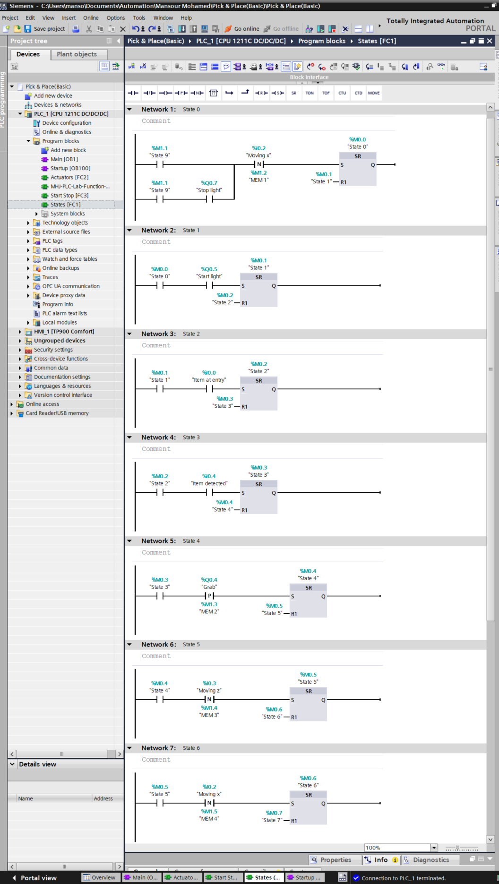
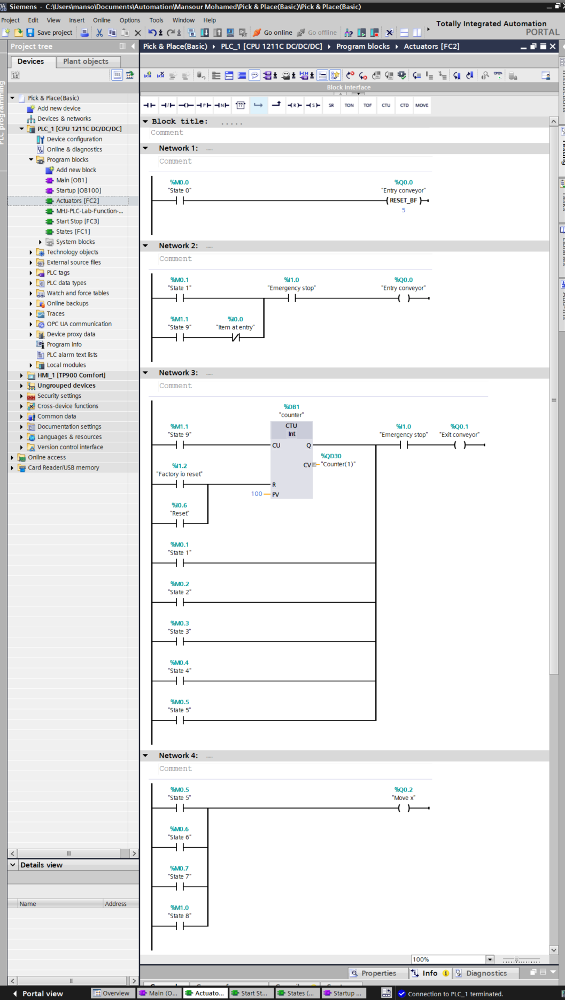
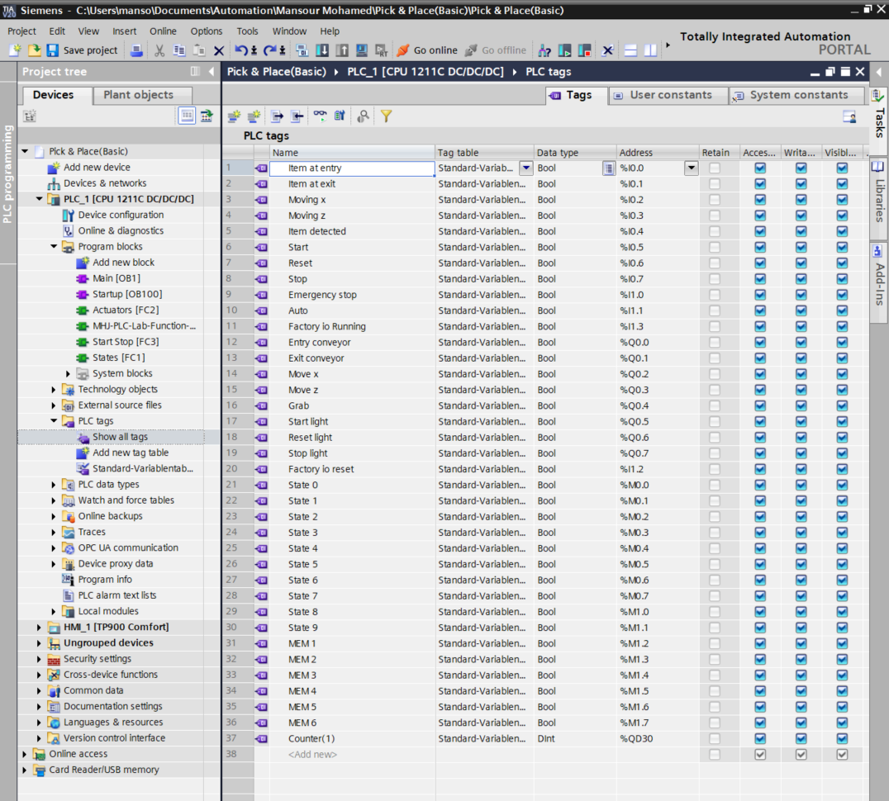

# Factory I/O Pick & Place (Basic) via Siemens S7-1200
### Finite State Machine (FSM) Implementation

This repository contains the complete PLC programming logic for automating a continuous "Pick and Place" station using a Siemens SIMATIC S7-1200 (CPU 1211C DC/DC/DC) and Factory I/O. 

## 🏗️ Software Architecture (Modular FSM)
The system is built entirely on a 10-state Finite State Machine (FSM) to ensure flawless mechanical sequencing and prevent physical collisions:

*   **OB100 (Startup):** Absolute system initialization to ensure the machine always boots into `State 0`.
*   **FC1 (The Brain - States):** The core FSM logic. It seamlessly shifts through 10 sequence states using Set/Reset based on precise sensor edge detection.
*   **FC2 (Actuators):** Pure hardware mapping. Standard coils are mapped to active states, ensuring outputs turn off automatically when the state changes.
*   **FC3 (Start/Stop):** Auto-loop management, Start/Stop logic, and safety indicator mappings.

## 💡 Key Engineering Solutions
**Emergency Pause Logic (No Data Loss):**
Instead of complex interlocks, the `EN` (Enable) pin to the FC1 block is cut when the Emergency Stop is triggered. The PLC brain "freezes", conveyors stop immediately via FC2, but the monostable pneumatic cylinders maintain their pressure and exact physical position. Upon release, the cycle resumes flawlessly.

**Reset Memory Isolation:**
The physical panel Reset (for logic counters) is completely separated from the Factory I/O environment reset to prevent memory overlapping.

## 📸 Project Visuals (Logic Snippets)
*(Here is a glimpse of the clean, modular ladder logic used in this project)*

### 1. FSM State Transitions (FC1)

### 2. Standard Coil Actuator Mapping (FC2)

### 3. PLC Tag Table

## 📂 Repository Contents
*   `ladder.pdf`: Full export of the TIA Portal Ladder Logic (OB100, FC1, FC2, FC3).
*   `tags.pdf`: Complete organized PLC Tag Table.
*   `Pick & Place(Basic).zap20`: The original Siemens TIA Portal V20 project archive.
